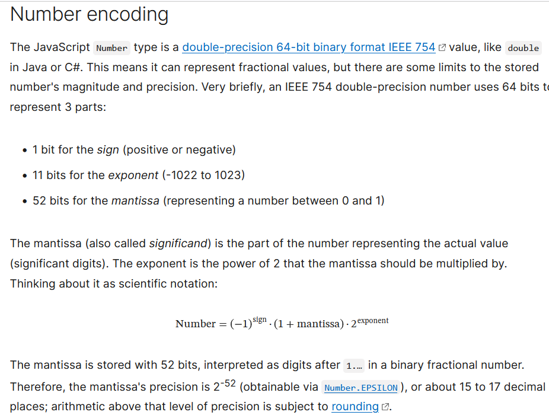

# Compactador Aritmético

## Trabalho da matéria Fundamentos de Sistemas Multimídia 24.1

| Alunos | Professora |
| ------ | ---------- |
| Rodrigo da Mota Sodre | Debora Christina Muchaluat Saade |
| Tamires da Hora dos Santos |

### Como utilizar:

Esse repositório contém 2 versões do compactador aritmético uma **Versão Básica** feita apenas em HTML + JS que informa os resultados através do console (usar a ferramenta inspecionar do seu navegador para ter acesso). E uma **Versão Gráfica** feita utilizando React e com a visualização de forma gráfica dos resultados.

1. Baixe o arquivo .zip ou clone o repositório. Depois siga as instruções específicas de cada versão.

| Versão Básica | Versão Gráfica |
| ------------- | -------------- |
| 2. Abra o arquivo .html no navegador de sua escolha | 2. Navegue até a pasta "ReactVersion" e Descompacte o arquivo "build (2).zip" |
| 3. Clique com o botão direito e selecione a opção "inspecionar" | 3. Navegue até a pasta extraida e abra o arquivo html no seu navegador |
| 4. Navegue até a aba console (Nessa aba que você conseguirá visualizar os resultados) | 4. Utilize o formulário HTML da página para testar o programa |
| 5. Utilize o formulário html para testar o programa |  |

---
### O que é um compactador aritmético?

Um compactador aritmético utiliza uma forma de compactação que converte um array de strings em um **número Real (&#8476;)** através do uso de uma tabela de probabilidades, que é fornecida ou criada pelo programa e que contém a chance de ocorrência de cada um dos caracteres da string.

---
### Etapas do Processo
| Compactação | Descompactação |
| ----------- | -------------- |
| 1. Recebe Input | 1. Recebe Input |
| 2. Separa blocos de Strings | 2. **[inicio loop]** Define o valor máximo e mínimo como as bordas do intervalo atual |
| 3. **[inicio loop]** pega a primeira string do array | 3. Define os intervalos correspondentes a cada caracter |
| 4. avalia a ocorrencia de cada caracter | 4. Verifica em qual intervalo o valor se encaixa |
| 5. seguindo a probabilidade de ocorrência encontra o valor codificado | 5. Adiciona o caracter equivalente ao intervalo a string de saída |
| 6. informa o valor codificado junto com a tabela de ocorrencias | 6. **[fim loop]** Redefine o valor do intervalo antigo para o intervalo atual |
| 7. **[fim loop]** retira a string do array |  |
---

### Problemas encontrados
- valor codificado precisa estar dentro dos limites usados em valor de ponto flutuantes de dupla precisão
-   Foi utilizado um limite de 13 caracteres na versão em React

 Códificação base (HTML + JS) 

---

 script.js 

| Funções | Descrição |
| ---- | ----- |
| *GetInput()* | Retira o input do formulário em HTML e converte o valor da variável para string. |
| *ClearOutputField()* | Reinicializa as variáveis de input. |
| *SplitString(string)* | Verifica se o tamanho do input está dentro do limite e, caso não esteja, separa o mesmo em strings menores. |
| *HandleCompactar2()* | Gerencia todo o processo de compactação da **mídia texto** utilizando Classes js como forma de modularizar o código. |

 Estrutura.js 

| Funções | Descrição |
| ---- | ----- |
| *createTable()* | Cria a tabela de probabilidades para uma string. |
| *addUnidade(tipo, carac, min, max, extreme)* | Adiciona um elemento da classe Unidade a lista de caracteres de uma instancia de Estrutura. |
| *codificacao()* | Faz a codificação aritmética de uma string guardando os respectivos valores máximos e mínimos de cada caracter. |
| *codificaFinalValue()* | Recupera o valor codificado da string. |
| *decodificacao()* | Faz a decodificação aritmética de uma string guardando os respectivos valores máximos e mínimos de cada caracter. |
| *decodificaFinalValue()* | Recupera o valor decodificado da string. |

 Unidade.js 

| Funções Atuais | Descrição |
| ---- | ----- |
| *defVal(minVal, maxVal)* | Defini um valor aleatório para um caracter (e, caso seja o último caracter da string, também para a string) a partir dos valores máximo e mínimo fornecidos. |

